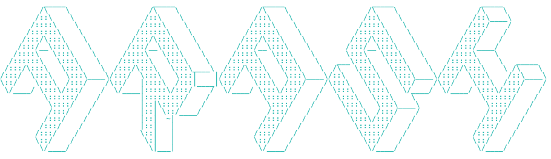

 

<h1 align="center">Hi , I'm Arash</h1>

 

A 27 years old self-taught DevOps & Backend developer from Iran

 

 

  
   
  
   
  
   
  

 

<h3 align="center">Latest Blog posts</h3>
 

<!-- BLOG-POST-LIST:START -->

- [مدیریت بهتر متغیر ها در Ansible](https://arash-hatami.ir/ansible-check-variables/)
- [تنظیم SSL در Traefik با ابرآروان](https://arash-hatami.ir/arvancloud-ssl-with-traefik/)
- [دستورات کاربردی و کمتر رایج در Git](https://arash-hatami.ir/rare-git-commands/)
- [روش نصب و تنظیم سرور DHCP در لینوکس](https://arash-hatami.ir/configure-dhcp-server/)
- [عبور از Captcha و حل خودکار آن](https://arash-hatami.ir/bypass-captcha/)
<!-- BLOG-POST-LIST:END -->

